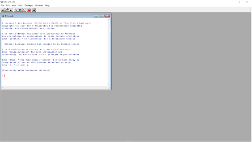

```{r setup, include=FALSE}
library(learnr)
x <- c(4, 1, 3, 8, 6, 7, 5, 3, 0, 9)
d <- factor(c("A", "A", "B", "C", "A", "B"))
mat <- matrix(c(1:9), ncol = 3, byrow = TRUE)
l <- list(3, rep(0, 3), matrix(c(1:4), ncol = 2))
df <- data.frame(V1 = 1:10, V2 = rep(1, 10), V3 = seq(1, 20, 2))
```

## Welcome


### Outline

* Install R and RStudio
* Install Packages
* Learn about File Types 
* Basics of R
* Learn Classes and Data Structures


## Install R and R Studio

### How to install R 

R is maintained by an international team of developers who make the language available through the web page of [The Comprehensive R Archive Network](https://cran.r-project.org/). The top of the web page provides three links for downloading R. Follow the link that describes your operating system: Windows, Mac, or Linux.

#### Windows
To install R on Windows, click the “Download R for Windows” link. Then click the “base” link. Next, click the first link at the top of the new page. This link should say something like “Install R for the first time,” then at the top of the next page will show you something like "Download R-4.5.2 for Windows" except the the number could be replaced by the most current version of R. The link downloads an installer program, which installs the most up-to-date version of R for Windows. Run this program and step through the installation wizard that appears. The wizard will install R into your program files folders and place a shortcut in your Start menu. Note that you’ll need to have all of the appropriate administration privileges to install new software on your machine.

#### Mac
To install R on a Mac, click the “Download R for Mac” link. Next, click on the R-4.5.2 package link (or the package link for the most current release of R). An installer will download to guide you through the installation process, which is very easy. The installer lets you customize your installation, but the defaults will be suitable for most users. I’ve never found a reason to change them. If your computer requires a password before installing new progams, you’ll need it here.


R isn’t a program that you can open and start using, like Microsoft Word or Internet Explorer. Instead, R is a computer language, like C, C++, or UNIX. You use R by writing commands in the R language and asking your computer to interpret them. In the old days, people ran R code in a UNIX terminal window—as if they were hackers in a movie from the 1980s. Now almost everyone uses R with an application called RStudio. Search for R version (4.5.2) in your programs on your local machine once it is downloaded and open the basic R user interface.

```{r, echo=FALSE, results="asis", out.width="90%"}

```

### How to install RStudio

RStudio is an Integrated Development Environment for R. What does that mean? Well, if you think of R as a language, which it is, you can think of RStudio as a program that helps you write and work in the language. RStudio is an application like Microsoft Word—except that instead of helping you write in English, RStudio helps you write in R. I use RStudio because it makes using R much easier. Also, the RStudio interface looks the same for Windows, Mac OS, and Linux.

You can download [RStudio](https://posit.co/downloads/) for free. Just click the “Download RStudio” button and follow the simple instructions that follow. Once you’ve installed RStudio, you can open it like any other program on your computer—usually by clicking an icon on your desktop.


When you open RStudio, a window appears with three panels in it, as below. The largest pane is a console window. This is where you’ll run your R code and see results. The console window is exactly what you’d see if you ran R from a UNIX console or the Windows or Mac GUIs. Everything else you see is unique to RStudio. Hidden in the other panes are a text editor, a graphics window, a debugger, a file manager, and much more. 


```{r, echo=FALSE, results="asis", out.width="90%"}
knitr::include_graphics("www/rstudio-panes-labeled.jpeg")
```

### RStudio Interface

The RStudio interface is composed of quadrants, each of which fulfils a unique purpose:

* The `Console` window,
* The `Source` window,
* The `Environment / History / Connections / Tutorial` window, and
* The `Files / Plots / Packages / Help / Viewer` window

Sometimes you might only see three windows and wonder where the Source window has gone in your version of RStudio. In order to use it you have to either open a file or create a new one. You can create a new file by selecting `File > New File > R Script` in the menu bar, or use the keyboard shortcut `Ctrl + Shift + N` on PC and `Cmd + Shift + N` on Mac.

#### The Console window

The console is located in the bottom-left, and it is where you often will find the output of your coding and computations. It is also possible to write code directly into the console. Let’s try the following example by calculating the sum of `10 + 5`. Click into the console with your mouse, type the calculation into your console and hit Enter/Return ↵ on your keyboard.

```{r, eval=FALSE}
  # We type the below into the console
  10 + 5
#> [1] 15
```


You just successfully performed your first successful computation. I know, this is not quite impressive just yet. R is undoubtedly more than just a giant calculator.

In the top right of the console, you find a symbol that looks like a broom. This one is quite an important one because it clears your console. Sometimes the console can become very cluttered and difficult to read. If you want to remove whatever you computed, you can click the broom icon and clear the console of all text. 


#### The Source window
In the top left, you can find the source window. The term ‘source’ can be understood as any type of file, e.g. data, programming code, notes, etc. The source panel can fulfil many functions, such as:

* Inspect data in an Excel-like format 

* Open programming code, e.g. an R Script 

* Open other text-based file formats, e.g.

  - Plain text (.txt),

  - Markdown (.rmd, .qmd),

  - Websites (.html),

  - LaTeX (.tex),

  - BibTex (.bib),

* Edit scripts with code in it,

* Run the analysis you have written.

In other words, the source window will show you whatever file you are interested in, as long as RStudio can read it. Another limitation of the source window is that it can only show text-based files. So opening images, etc. would not work.

#### The Environment / History / Connections / Tutorial window
The window in the top right shows multiples panes. The first pane is called Environment and shows you objects which are available for computation. One of the first objects you will create is your dataset because, without data, we cannot perform any analysis. Another object could be a plot showing the number of male and female participants in your study. Besides datasets and plots, you will also find other objects here, e.g. lists, vectors and functions you created yourself. For now, remember this is a place where you can find different objects you created.

#### The Files / Plots / Packages / Help / Viewer window
The last window consists of five essential panes. The first one is the Files pane. As the name indicates, it lists all the files and folders in your root directory. A root directory is the default directory where RStudio saves your files, for example, your data Thus, the Files pane is an easy way to load data into RStudio and create folders to keep your research project well organised.

Since the Console cannot reproduce data visualisations, RStudio offers a way to do this very easily. It is through the Plots pane. This pane is exclusively designed to show you any plots you have created using R. 

If you wish to delete the plot, you can click on the red circle with a white x symbol. This will delete the currently visible plot. If you wish to remove all plots from this pane, you can use the broom. There is also an option to export your plot and move back and forth between different plots.

The next pane is called Packages. Packages are additional tools you can import and use when performing your analysis. A frequent analogy people use to explain packages is your phone and the apps you install. Each package you download is equivalent to an app on your phone. It can enhance different aspects of working in R, such as creating animated plots, using unique machine learning algorithms, or simply making your life easier by doing multiple computations with just one single line of code.

If you are in need of help, RStudio provides you with a Help pane. You can search for specific topics, for example how certain computations work. The Help pane also has documentation on different datasets that are included in R, RStudio or R packages you have installed. If you want a more comprehensive overview of how you can find help, have a look at CRAN’s [‘Getting Help with R’](https://www.r-project.org/help.html) webpage.

#### Customise your user interface
I would like to make you aware that you can modify each window. There are some basic adjustments you can make:

* Hide panes by clicking on the window symbol in the top right corner of each window,

* Resize panes by dragging the border of a window horizontally or vertically, or

* If you want a fully customised experience you can also alter the color scheme of RStudio itself (`RStudio > Preferences > Appearance`).


## Install Packages

Many of R’s most useful functions do not come preloaded when you start R, but reside in packages that can be installed on top of R. R packages are similar to libraries in C, C++, and Javascript, packages in Python, and gems in Ruby. An R package bundles together useful functions, help files, and data sets. You can use these functions within your own R code once you load the package they live in. Usually the contents of an R package are all related to a single type of task, which the package helps solve. R packages will let you take advantage of R’s most useful features: its large community of package writers (many of whom are active data scientists) and its prewritten routines for handling many common (and exotic) data-science tasks.


> You may hear R users (or me) refer to “base R.” What is base R? It is just the collection of R functions that gets loaded every time you start R. These functions provide the basics of the language, and you don’t have to load a package before you can use them.

Base are includes:

 * `base` – fundamental functions such as arithmetic operations, logical comparisons, and basic data structures
 * `stats` – core statistical functions
 * `graphics` – basic plotting functions
 * `utils` – utility functions for reading data and working with files


### How to install R packages

To use an R package, you must first install it on your computer and then load it in your current R session. The easiest way to install an R package is with the install.packages R function. Open R and type the following into the command line:

> install.packages("<package name>")
  
This will search for the specified package in the collection of packages hosted on the CRAN site. When R finds the package, it will download it into a libraries folder on your computer. R can access the package here in future R sessions without reinstalling it. 

Anyone can write an R package and disseminate it as they like; however, almost all R packages are published through the CRAN website. CRAN tests each R package before publishing it. This doesn’t eliminate every bug inside a package, but it does mean that you can trust a package on CRAN to run in the current version of R.

You can install multiple packages at once by linking their names with R’s concatenate function, c. For example, to install the tidyverse, run:

> install.packages("tidyverse")
  
If this is your first time installing a package, R will prompt you to choose an online mirror of to install from. Mirrors are listed by location. Your downloads should be quickest if you select a mirror that is close to you. If you want to download a new package, try the Iowa mirror first. 


If you prefer not to install packages using code, RStudio also provides a point-and-click option. In the menu at the top of RStudio, go to Tools → Install Packages…. 

A window will open where you can search for packages by name, select where to install them, and choose whether to install dependencies. Once you click Install, RStudio will run the necessary commands in the background for you.

This approach can be especially helpful when you are just starting out or if you are not sure of the exact package name. Behind the scenes, RStudio is still using the `install.packages()` function, this menu option is simply a more user-friendly way to do the same thing.

#### Loading Packages

Installing a package doesn’t immediately place its functions at your fingertips. It just places them on your computer. To use an R package, you next have to load it in your R session with the command:

> library("package name")
  
Notice that the quotation marks have disappeared. You can use them if you like, but quotation marks are optional for the library command. (This is not true for the install.packages command).

`library` will make all of the package’s functions, data sets, and help files available to you until you close your current R session. The next time you begin an R session, you’ll have to reload the package with library if you want to use it, but you won’t have to reinstall it. You only have to install each package once. After that, a copy of the package will live in your R library. To see which packages you currently have in your R library, run:

> library()
  
library() also shows the path to your actual R library, which is the folder that contains your R packages. You may notice many packages that you don’t remember installing. This is because R automatically downloads a set of useful packages when you first install R.

## File Types

There are many types of files that you will interact with when using R and Rstudio.

1. R Files
* `.R` – an R script file. This file contains only R code and is typically used for writing and running analyses line by line.

* `.Rmd` – an R Markdown file. This file combines R code and text (written in Markdown) in a single document. When you knit an .Rmd file, R runs the code and compiles the text and results together to create an output file such as an .html, .pdf, or .docx.

* `.qmd` – a Quarto document. Quarto is a newer, more flexible publishing system that supports R, Python, Julia, and other languages. Like R Markdown, Quarto documents mix code and text and can be rendered into reports, presentations, or websites. Quarto is now the recommended system for new projects.

* `.Rproj` – an R Project file. This works with RStudio to help you organize your work. When you open an .Rproj file, RStudio automatically sets the working directory to that folder, making it easier to manage data, scripts, and output files.

2. Data Files

* `.csv` – a comma-separated values file, commonly used for storing tabular data

* `.xlsx` – an Excel file

* `.txt` – a plain text file, often used for data or notes

* `.rds` – an R data file that stores a single R object and preserves its structure

* `.RData` – an R data file that can store multiple R objects at once, including your entire workspace (environment). While .RData files can be useful for temporarily saving work, we generally avoid relying on them for analysis. For reproducibility, it is best practice to start projects from an empty environment and recreate all objects by running code, rather than loading saved environments.

3. Output Files

* `.html` / `.pdf` – common output files created when rendering .Rmd or .qmd documents


## Why use an R Project?

An R Project provides a clean, self-contained workspace for a specific analysis or project When you open an .Rproj file:

- RStudio automatically sets the working directory to the project folder

- File paths become simpler and more reliable (no `setwd()` needed)

- All scripts, data, figures, and output stay organized in one place

- You avoid conflicts between different projects on your computer

Using R Projects also supports reproducible workflows. If someone else opens your project folder (or you reopen it later), the code will run the same way because file locations are consistent and the environment starts clean.

You will notice what project you are working in in the upper right hand corner by the R cube. To create a new R project or open one, click to the right of the cube and select New Project.

**Do yourself** Create a R project for this class with all the files downloaded for the course.

The code for this is created in an Rmd that turns it into at `Learnr` tutorial. This is easy to follow guided practice for when you are first learning to code. 

The next section will start using R and you will see code chunk of R that you can run on this tutorial but I recommend starting an R script to follow along with. To do this go to File – New File – R Script.


## Basics of R

### Assignment

We assign the value of an object on the left hand side, to the name (expression) on the right hand side. This tells R what to call the object or variable.

```{r assign,exercise = TRUE}
# Preferred syntax
height <- 442

# These also work
442 -> height
height = 442

height
```


### Comments
Comments are notes (or comments) that are made in a code chunk that does not get run but is there for human use.
```{r comment}
# This is how you make a comment!
```


> R is Case Sensitive

```{r note}
# These are all different objects
name <- "greg" 
Name <- "steve"
NAME <- "mary"
```

### Operations
R is a big calculator!
```{r calc}
# Add
3 + 3

# Subtract
6 - 3

# Multiply
4 * 3

# Divide
6 / 2

# Floored quotient
floor(7 / 2)

# Ceiling quotient
ceiling(7 / 2)

# Remainder or modulus
7 %% 2

# Absolute value
abs(-5)

```


## Classes and Data Structures 

### Classes

A variable can store different types of values such as numbers, characters, etc. These different types of data that we can use in our code are called data types which belong to a certain class.

Common data types and classes 

1. numeric: any real number(s)
2. character: strings or individual characters, quoted
3. integer: any integer(s)/whole numbers
4. factor: categorical/qualitative variables
5. logical: variables composed of TRUE or FALSE
6. Date/POSIXct: represents calendar dates and times


```{r types}
# Default to numeric
height <- 442
class(as.integer(height))

height <- 442.0
class(height)

# Character
height <- "really tall"
class(height)

# Can force it to be an integer
height <- as.integer(442)
class(height)
object.size(height)
```

Convert to different types

```{r convert}
# Convert numeric to integer
a <- 5
a <- as.integer(a)

# Convert character to numeric
a <- "5"
a <- as.numeric(a)

# Convert numeric to character
a <- 5
a <- as.character(a)
```

### Data Structures

#### Vectors in R
Vectors in R can only contain elements of a single class. Here's an example of creating and working with a numeric vector:

```{r vector,exercise = TRUE}
x <- c(4, 1, 3, 8, 6, 7, 5, 3, 0, 9)
x
```

##### Subsetting Vectors
Subsetting allows you to extract specific elements from a vector:

```{r subset_vector}
x[1] ## first element
x[1:5] ## first 5 using the colon
```

##### Vector Operations
You can perform various operations on vectors:

```{r vector_opt,exercise = TRUE}
y <- 1:10
x + y
1 / x
```


#### Factors

Factors are essential in statistics. They represent categorical variables:

```{r factor,exercise = TRUE}
d <- factor(c("A", "A", "B", "C", "A", "B"))
d
```

#### The `paste` Function
The `paste` function is used to combine character strings:

```{r paste,exercise = TRUE}
f <- paste("x", 1:5, sep = "")
f
```


#### Matrices in R
Matrices are two-dimensional arrays in R:
```{r matrix,exercise = TRUE}
mat <- matrix(c(1:9), ncol = 3, byrow = TRUE)
mat
```

##### Subsetting Matrices
Subsetting matrices involves specifying both row and column indexes:
```{r subset_matrix}
mat[1, 1]
mat[1, ]
```

#### Lists in R
Lists are versatile R objects, able to hold elements of various classes:

```{r list,exercise = TRUE}
l <- list(3, rep(0, 3), matrix(c(1:4), ncol = 2))
l
```


##### Indexing Lists
Lists can be indexed using double brackets or the `$` notation:

```{r index_list,exercise = TRUE}
l[[3]]
l$three
```


#### Data Frames in R
Data frames combine properties of matrices and lists, suitable for data analysis:
```{r dataframe,exercise = TRUE}
df <- data.frame(V1 = 1:10, V2 = rep(1, 10), V3 = seq(1, 20, 2))
df
```


##### Subsetting Data Frames
Data frames can be subsetted by index or name:

```{r subset_dataframe,exercise = TRUE}
df[,1]
df[1,]
```


#### Summary and Table Functions
Use `summary` for a five-number summary and `table` for frequency tables:

```{r sum_tab,exercise = TRUE}
summary(df)
table(df$V3)
```

